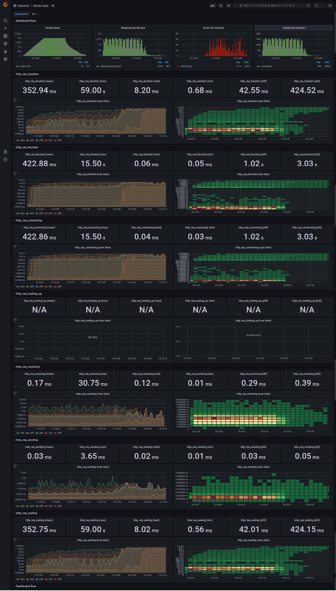

# K6 + Grafana using Influxdb

## How To Run
### Setting Up
- Using docker compose to start influxdb and grafana: `docker-compose up -d influxdb grafana`
### Run Test Manually
- From root folder run command: `k6 run -o influxdb=http://localhost:8086/<influxdb name> test_script.js`
	with `influxdb name` is db name to store results of test.
  
## View Testing Results On Grafana
- Using your browser to access `http://localhost:3000`
- On main site, click on `+` button --> `Import`
- Choose upload and browse to `dashboard.json`
- Change dashboard name and click `Import`
- Config your dashboard to connect to your influxdb
- Result: 

## Info
- Metrics: [link](https://k6.io/docs/using-k6/metrics)
- Custom metrics: [link](https://k6.io/docs/using-k6/metrics/#custom-metrics)